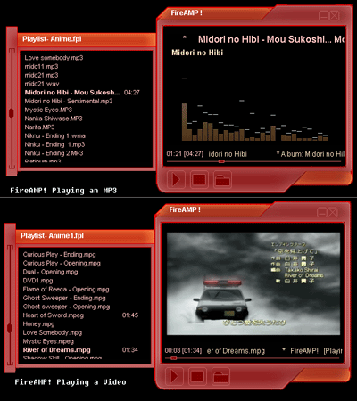



## FireAMP\!

### Description

FireAMP! is a *simple* media player written in vb6.

features:

* FFT analysis of sound (or simply visualizations) around 14 visualizations

* MP3 tag reading

* Video in player itself, full screen

* Scan disk for media

* save playlists

* Media tracker mode: when minimized, it becomes a small player that always stays on top of any app.

Skinning is not yet perfected. i've included a skin compiler source code and the source code for a skin packager, so compile the dll first.

Great for anyone lookin' for some ideas on writing and using FFT and visualizations.

Comments will be nice!
 
### More Info
 

             |
---                |---
**Submitted On**   |2005-11-04 15:02:56
**By**             |[\[HalfDemon\]](https://github.com/Planet-Source-Code/PSCIndex/blob/master/ByAuthor/halfdemon.md)
**Level**          |Advanced
**User Rating**    |4.9 (44 globes from 9 users)
**Compatibility**  |VB 5\.0, VB 6\.0
**Category**       |[Sound/MP3](https://github.com/Planet-Source-Code/PSCIndex/blob/master/ByCategory/sound-mp3__1-45.md)
**World**          |[Visual Basic](https://github.com/Planet-Source-Code/PSCIndex/blob/master/ByWorld/visual-basic.md)
**Archive File**   |[FireAMP\!1946451162005\.zip](https://github.com/Planet-Source-Code/halfdemon-fireamp__1-62827/archive/master.zip)

